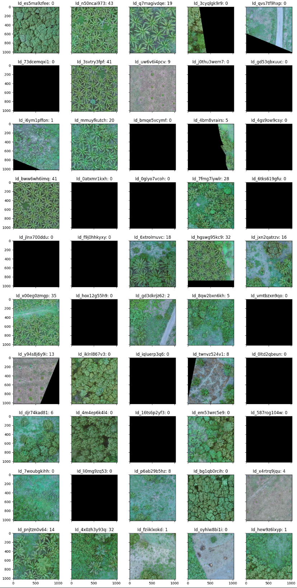

# [Digital Africa Plantation Counting Challenge](https://zindi.africa/competitions/digital-africa-plantation-counting-challenge/discussions)

The objective of this challenge is to create a semi-supervised machine learning algorithm to count the number of palm oil trees in an image as part of the Zindi Digital Africa Plantation Counting Challenge.

Palm oil is an edible vegetable oil derived from the mesocarp (reddish pulp) of the fruit of the oil palms. The oil is used in food manufacturing, beauty products, and as biofuel.

This will aid farmers to determine the number of trees on their plot and estimated crop yield. The semi supervised nature of this solution will allow this solution to be applied to other plantations such as banana palms.

## Data:
This data was collected using drones over 4 farms in Côte d'Ivoire in July and September 2022.

There are 2002 images in train. There are 858 images in test.

The objective of this challenge is to create a semi-supervised machine learning algorithm to count the number of palm oil trees in an image.

Some images might contain 0 palm oil trees as it is the edge of a field.




## Dependencies:
 + Python 3.7
 + Pytorch 1.13
 + torchvision
 + pandas
 + opencv-python
 + scikit-learn
 + efficientnet_pytorch

## Installation and Running Project
To run this project, you need to have Python 3.7 and PyTorch installed on your system. This can be achieved using the [Pytorch Docker container](https://hub.docker.com/r/pytorch/pytorch/tags).

To run on CPU you can install via the requirements.

``` bash
pip install -r requirements-cpu.txt
```

For running on a remote instance with a GPU several scripts are provided for installing and transferring the project code in the `scripts` directory.

1. For initialising project on a remote machine, transferring code, downloading project data, and installing requirements use `remote-init.sh`.

``` bash
bash remote-init.sh <hostname> <hostip> <auth_token>
```
See [zindi download data](https://zindi.africa/learn/how-to-download-data-files-from-zindi-to-colab) for information on obtaining an `auth_token`.

2. For running the project the `remote-run.sh` script can be used, this allow multiple experiments to be tried sequentially by specifying multiple parameter files:

``` bash
bash remote-run.sh
```

3. For pushing local changes and fetching project runs the `remote-sync.sh` bash script can be used:

``` bash
bash remote-sync.sh  <hostname> <hostip>
```

## Evaluation:
The error metric for this competition is the Root Mean Squared Error.

For every row in the dataset, submission files should contain 2 columns: Image_ID and Count.

```csv
Image_ID         Count
GL5_15360_8192    5
GL5_15360_9216    12
```

## Results:
The `runs.csv` collects information about training runs:

 + `run` - Name of run constructed using run date, time, and model>
 + `loss` - The validation loss achieved on the run.
 + `model_name` - The pretrained model used.
 + `learning_rate` - The learning rate as a float.
 + `batch_size` - The number of images in a batch.
 + `image_size` - The size of image used in neural network.
 + `image_rescaler` - Whether images were rescaled as a boolean.
 + `blur_kernel` - The data augmentation blur kernel used.
 + `blur_sigma` - The data augmentation blur sigma value.
 + `mem_usage` - The maximum memory usage from training the network.
 + `elapsed_time` - The total training time in seconds.


```csv
run,loss,model_name,learning_rate,batch_size,image_size,image_rescaler,blur_kernel,blur_sigma,mem_usage,elapsed_time
20230331_140249_efficientnet-b3,2.513471749011833,efficientnet-b3,0.001,5,1024,False,"[1, 9]","[0.1, 2]",20939,6099
20230331_160035_efficientnet-b7,2.640660398335445,efficientnet-b7,0.001,5,600,True,"[1, 9]","[0.1, 2]",22193,8312
20230403_101552_efficientnet-b5,2.756092071533203,efficientnet-b5,0.0001,15,456,True,"[1, 5]","[0.1, 2]",22636,6605
20230403_154042_resnet152,3.4628835824819713,resnet152,0.001,20,448,True,"[1, 5]","[0.1, 2]",18095,5187
20230405_115823_resnet18,9.4072,resnet18,0.001,200,224,False,"[1, 5]","[0.1, 2]",9440,2276
20230405_150544_efficientnet-b4,3.3791623711586,efficientnet-b4,0.0005,67,380,False,"[1, 7]","[0.1, 2]",47341,6563

```
